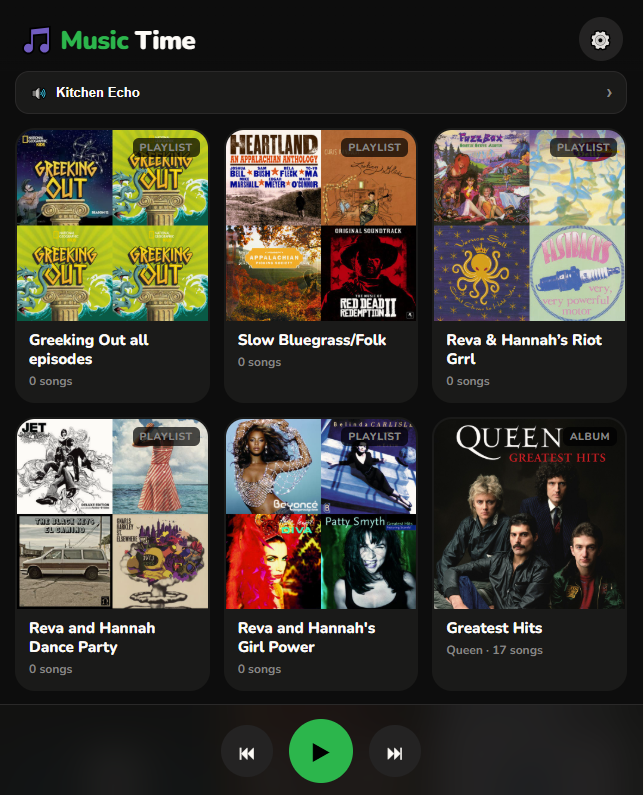

# 🎵 Music Time

A simple, kid-friendly Spotify playlist picker designed to run on an iPad or iPhone. Kids tap a playlist or album card to play it on a designated Spotify Connect speaker (like an Amazon Echo). A PIN-locked settings screen lets parents control what music is available.



## Features

- 🎵 Visual grid of playlists and albums with cover art
- 🔊 Plays to any Spotify Connect speaker (Echo, Sonos, etc.)
- 🔐 PIN-locked settings so kids can't change anything
- ➕ Browse and select from your Spotify library directly in the app
- ⏮ ⏸ ⏭ Floating playback controls at the bottom
- 📱 Works as a full-screen home screen app on iOS (via Safari → Add to Home Screen)
- 🔒 No server required — purely client-side, all data stays in the browser

---

## What you need

- A **Spotify Premium** account
- A **Spotify Connect** speaker (Amazon Echo, Sonos, etc.)
- A free place to host the HTML file (Netlify, GitHub Pages, Cloudflare Pages)
- A free **Spotify Developer** app (takes about 5 minutes to set up)

---

## Setup

### Step 1 — Create a Spotify Developer app

1. Go to [developer.spotify.com/dashboard](https://developer.spotify.com/dashboard) and log in
2. Click **Create app**
3. Give it any name and description (e.g. "Music Time")
4. Under **Redirect URIs**, add the URL where you'll host the file — for example `https://your-site.netlify.app` — and click **Add**
5. Set the **API / SDK** type to **Web API**
6. Save the app and copy your **Client ID** from the app dashboard

### Step 2 — Add your Client ID to the file

Open `kids-spotify.html` in any text editor and find this line near the top of the `<script>` section:

```js
const CLIENT_ID = 'YOUR_CLIENT_ID_HERE';
```

Replace `YOUR_CLIENT_ID_HERE` with your Client ID. Save the file.

> ⚠️ **Don't commit your Client ID to a public GitHub repo.** It's not a security risk (this app uses PKCE — there's no secret key), but it's good hygiene to keep it out of public version control. See the [Keeping your Client ID private](#keeping-your-client-id-private) section below.

### Step 3 — Host the file

Any static host with HTTPS works. Two good free options:

**Option A — Netlify Drop (easiest, no account needed)**

1. Go to [app.netlify.com/drop](https://app.netlify.com/drop)
2. Drag `kids-spotify.html` onto the page
3. Netlify gives you a URL like `https://peaceful-newton-abc123.netlify.app`

Your Client ID stays out of any public repository this way.

**Option B — GitHub Pages**

1. Create a repository and commit `kids-spotify.html` (with your Client ID already filled in)
2. Go to **Settings → Pages**, set the source branch to `main`, and save
3. GitHub gives you a URL like `https://yourusername.github.io/repo-name/kids-spotify.html`

> ⚠️ **Note on the Client ID:** because GitHub Pages requires the file to be committed to the repository, your Client ID will be visible in the repo. If the repo is public, anyone can see it. For a PKCE-based app like this one, the Client ID is not a secret in the traditional sense — there is no client secret, and the OAuth redirect URI prevents anyone from authenticating as you using your Client ID alone. The practical risk is low. That said, if this bothers you, use a **private repository** (GitHub Pages works with private repos on paid plans) or use Netlify Drop instead.

In either case, make sure the final URL exactly matches the Redirect URI you added in Step 1.

### Step 4 — Connect to Spotify

Open the URL in Safari on your iPad or iPhone and tap **Connect Spotify**. Log in with your Spotify account and approve the permissions.

### Step 5 — Choose a speaker

Tap the **🔊 speaker bar** at the top of the app. Your Spotify Connect devices will appear — tap your Echo or other speaker to select it.

> If your Echo doesn't appear, say "Alexa, play Spotify" first to wake it up, then tap Refresh.

### Step 6 — Add music

Tap **⚙️** (default PIN: `1234`) to open Settings. Under **Music on the Grid**:

- **My Playlists** — browse your Spotify playlists and tap to toggle them on/off
- **My Albums** — browse your saved albums
- **Add by URL** — paste any Spotify playlist or album URL

Tap **Done** when finished. The kids are ready to go!

### Step 7 — Add to Home Screen (optional but recommended)

In Safari on the iPad, tap **Share → Add to Home Screen**. The app launches full-screen with no browser chrome, like a native app.

---

## First-time use tips

- **Change the PIN** in Settings → Parent PIN before handing the iPad to your kids. The default is `1234`.
- **Wake the Echo before kids use it** — Spotify Connect speakers need to have been active recently. If playback fails with an error, just ask Alexa to play anything on Spotify first, then try again.
- **Token expiry** — Spotify access tokens expire, but the app refreshes them automatically in the background. If the app ever stops working after a long idle period, just log out and log back in.

---

## Keeping your Client ID private

If you want to store the file in a public GitHub repo without exposing your Client ID:

**Option A — Use a template file**

Keep a `kids-spotify.template.html` in the repo with `YOUR_CLIENT_ID_HERE` as the placeholder, and add the real `kids-spotify.html` to `.gitignore`:

```
# .gitignore
kids-spotify.html
```

**Option B — Use a separate config comment**

Leave the placeholder in the committed file and fill it in locally before deploying. Just remember not to commit the filled-in version.

---

## How it works

This app uses:

- **Spotify Authorization Code + PKCE** — a secure OAuth flow designed for client-side apps with no backend. The Client ID is intentionally public; there is no client secret.
- **Spotify Web API** — to fetch your playlists and albums, and to send playback commands to your speaker via Spotify Connect.
- **localStorage** — to persist your selected playlists, chosen speaker, and PIN between sessions.

No data is sent anywhere other than Spotify's own API. No analytics, no tracking, no ads.

---

## Troubleshooting

**"Couldn't load playlists/albums"**
You probably need to log out and log back in. This happens when the app was updated with new permission scopes after your initial login. Go to Settings → Account → Log out, then log back in.

**"Speaker unreachable"**
The Echo has gone idle. Ask Alexa to play something on Spotify, wait a few seconds, then try again.

**PIN modal does nothing when I enter the PIN**
Make sure you're running the latest version of the file. An earlier version had a timing bug with the PIN → Settings transition that has since been fixed.

**The app logged me out**
Spotify refresh tokens can expire if unused for an extended period, or if you revoke access in your Spotify account settings. Just log back in.

---

## License

MIT — do whatever you want with it.
